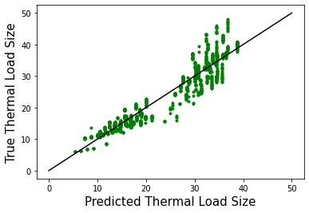
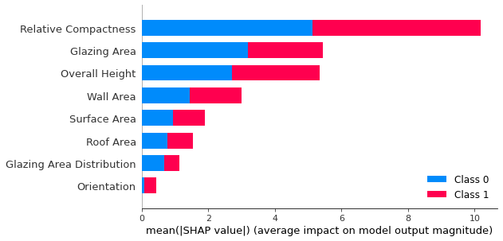

```{r setup, include=FALSE}
knitr::opts_chunk$set(echo = TRUE)
```
**Part 1**
<br>
*Project Description:*
Calculating accurate thermal load requirements of any particular building is one of the primary tools in predicting the energy efficiency and improving the economic value added for any property owner by minimizing HVAC costs/usage. In the first part of our project, we plan to explore various building-related variables—surface area, roof area, and overall height, for example—and their relationship with energy efficiency. In the second part, we will attempt to determine an aspect with a significant relationship to energy efficiency from the first part and create an accurate model in order to predict energy efficiency.
</br>
<br>
*Goals:*
The goal of the project is to explore the relationship of each of the variables: the building’s Surface Area (X2), Wall Area (X3), Roof Area (X4), Overall Height (X5) and Glazing Area (X7) with the heating (Y1) and cooling loads (Y2).  Another goal is to create a scatter plot for Y1 (y-axis) against each of the  X variables (x-axis) and create a scatter plot for Y2 (y-axis) against each X variable to visualize and interpret the data. 
</br>
<br>
*Link to Data:*
[Building and Thermal Load Data](https://archive.ics.uci.edu/ml/machine-learning-databases/00242/ENB2012_data.xlsx)
</br>
<br>
*Data Description:*
This particular data set was donated to the UCI Machine Learning Repository by civil engineering industry professional, Angeliki Xifara, and researcher, Athanasios Tsanas, at the University of Oxford in 2012. Each object of the data set represents a distinct building type (modeled after one of 12 distinct residential building classes) that was generated in Autodesk Ecotect by simulating different values in place of attributes X1:X8. We prepared the data set by converting/importing the .XLSX file and converting all appropriate variables to either a numerical or categorical data type. The original data set was comprised of 768 objects and could be further cleaned.
</br>
<br>
*References:*

1.  Joshua Kneifel, Beyond the code: Energy, carbon, and cost savings using conventional technologies, Energy and Buildings, Volume 43, Issue 4,Pages 951-959,ISSN 0378-7788 (2011). https://doi.org/10.1016/j.enbuild.2010.12.019

2.  A. Tsanas, A. Xifara: 'Accurate quantitative estimation of energy performance of residential buildings using statistical machine learning tools', Energy and Buildings, Vol. 49, pp. 560-567, (2012). https://doi.org/10.1016/j.enbuild.2012.03.003 

3.  Ling, J., Zhao, L., Xing, J. et al. Statistical analysis of residential building energy consumption in Tianjin. Front. Energy 8, 513–520 (2014). https://doi.org/10.1007/s11708-014-0327-5

4.  Yan, S., Li, X. Comparison of space cooling/heating load under non-uniform indoor environment with convective heat gain/loss from envelope. Build. Simul. 14, 565–578 (2021). https://doi.org/10.1007/s12273-020-0708-0

5.  Obrinsky, M., & Walter, C. (2016). Energy Efficiency in Multifamily Rental Homes: An Analysis of Residential Energy Consumption Data. The Journal of Sustainable Real Estate, 8(1), 2–19. https://www.jstor.org/stable/24876479
</br>
<br>
**Below is the code for Exploratory Analysis.**
</br>

```{r}
library(tidyverse)
```

```{r}
data1 <- "https://archive.ics.uci.edu/ml/machine-learning-databases/00242/ENB2012_data.xlsx"
lcl <- basename(data1)
download.file(url = data1, destfile = lcl)
library(readxl)
ENB2012_data <- read_excel(lcl)
library(ggplot2)

ENB2012_data$X2 <- as.factor(ENB2012_data$X2)
ggplot(data=ENB2012_data, aes(x=X2, y=Y1)) + geom_boxplot() + xlab("Surface Area (Lengths^2)") + ylab("Heating Load (BTU)")
ggplot(data=ENB2012_data, aes(x=X2, y=Y2)) + geom_boxplot() + xlab("Surface Area (Lengths^2)") + ylab("Cooling Load (BTU)")

ENB2012_data$X4 <- as.factor(ENB2012_data$X4)
ggplot(data=ENB2012_data, aes(x=X4, y=Y1)) + geom_boxplot() + xlab("Roof Area (Lengths^2)") + ylab("Heating Load (BTU)")
ggplot(data=ENB2012_data, aes(x=X4, y=Y2)) + geom_boxplot() + xlab("Roof Area (Lengths^2)") + ylab("Cooling Load (BTU)")

ENB2012_data$X5 <- as.factor(ENB2012_data$X5)
ggplot(data=ENB2012_data, aes(x=X5, y=Y1)) + geom_boxplot() + xlab("Overall Height (lengths)") + ylab("Heating Load (BTU)")
ggplot(data=ENB2012_data, aes(x=X5, y=Y2)) + geom_boxplot() + xlab("Overall Height (lengths)") + ylab("Cooling Load (BTU)")

ENB2012_data$X7 <- as.factor(ENB2012_data$X7)
ggplot(data=ENB2012_data, aes(x=X7, y=Y1)) + geom_boxplot() + xlab("Glazing Area (Lengths^2)") + ylab("Heating Load (BTU)")
ggplot(data=ENB2012_data, aes(x=X7, y=Y2)) + geom_boxplot() + xlab("Glazing Area (Lengths^2)") + ylab("Cooling Load (BTU)")
```

```{r}
data1 <- "https://archive.ics.uci.edu/ml/machine-learning-databases/00242/ENB2012_data.xlsx"
lcl <- basename(data1)
download.file(url = data1, destfile = lcl)
library(readxl)
ENB2012_data <- read_excel(lcl)
library(ggplot2)
df <- ENB2012_data %>% rename("Surface Area"=X2, "Roof Area"=X4, "Overall Height"=X5, "Glazing Area"=X7) %>% select(2,4,5,7)
cormat <- df %>% cor()
cormat
cor_table <- cormat %>% as.data.frame %>% rownames_to_column("var1")
tidycor <- cor_table %>% pivot_longer(-1, names_to = "var2", values_to = "correlation")
tidycor %>% ggplot(aes(var1, var2, fill=correlation)) + geom_tile() + scale_fill_gradient2(low="red", mid="white", high = "blue") + geom_text(aes(label=round(correlation,2)),color = "black", size = 4) + theme(axis.text.x = element_text(angle = 90)) + coord_fixed()
```
<br> 
**Below is the code for Regression.**
</br>
```python
import numpy as np
import matplotlib.pylab as plt
import pandas as pd
from sklearn.linear_model import LinearRegression
from sklearn.model_selection import train_test_split
from sklearn.ensemble import RandomForestRegressor
from sklearn import metrics
import shap
```


```python
enb12 = pd.read_csv('ENB2012_data.csv')
enb12.head()
enb12['X1'] = pd.to_numeric(enb12['X1'], errors='coerce')
enb12['X2'] = pd.to_numeric(enb12['X2'], errors='coerce')
enb12['X3'] = pd.to_numeric(enb12['X3'], errors='coerce')
enb12['X4'] = pd.to_numeric(enb12['X4'], errors='coerce')
enb12['X5'] = pd.to_numeric(enb12['X5'], errors='coerce')
enb12['X6'] = pd.to_numeric(enb12['X6'], errors='coerce')
enb12['X7'] = pd.to_numeric(enb12['X7'], errors='coerce')
enb12['X8'] = pd.to_numeric(enb12['X8'], errors='coerce')
enb12['Y1'] = pd.to_numeric(enb12['Y1'], errors='coerce')
enb12['Y2'] = pd.to_numeric(enb12['Y2'], errors='coerce')

enb12 = enb12.dropna()
enb12.columns = ['Relative Compactness', 'Surface Area', 'Wall Area', 'Roof Area', 'Overall Height', 'Orientation', 'Glazing Area', 'Glazing Area Distribution', 'Heating Load', 'Cooling Load']
print (enb12.head())
```

       Relative Compactness  Surface Area  Wall Area  Roof Area  Overall Height  \
    0                  0.98         514.5      294.0     110.25             7.0   
    1                  0.98         514.5      294.0     110.25             7.0   
    2                  0.98         514.5      294.0     110.25             7.0   
    3                  0.98         514.5      294.0     110.25             7.0   
    4                  0.90         563.5      318.5     122.50             7.0   
    
       Orientation  Glazing Area  Glazing Area Distribution  Heating Load  \
    0          2.0           0.0                        0.0         15.55   
    1          3.0           0.0                        0.0         15.55   
    2          4.0           0.0                        0.0         15.55   
    3          5.0           0.0                        0.0         15.55   
    4          2.0           0.0                        0.0         20.84   
    
       Cooling Load  
    0         21.33  
    1         21.33  
    2         21.33  
    3         21.33  
    4         28.28  


```python
def run_energyload_regression(df, X, regression_name):

    Y = enb12[['Heating Load', 'Cooling Load']]
    
    reg = LinearRegression().fit(X, Y)
    reg.coef_, reg.intercept_
    
    y_pred = reg.predict(X)
    
    # Diagnosis plot
    plt.plot(y_pred, Y, '.g')
    plt.plot([0, 50], [0, 50], 'k')
    plt.xlabel('Predicted Thermal Load Size', size = 15)
    plt.ylabel('True Thermal Load Size', size = 15)
    plt.show()
    
    # Calculate the absolute errors
    errors = abs(y_pred - Y)
    
    # Calculate mean squared error
    mse = np.mean((Y - y_pred)**2)
    print(regression_name + ' MSE:')
    print(mse)
    
    importance = reg.coef_
    
    explainer = shap.LinearExplainer(reg,X)
    shap_values = explainer.shap_values(X[::200])
    shap.summary_plot(shap_values, X[::200])
    
    return reg

X = enb12[['Relative Compactness', 'Surface Area', 'Wall Area', 'Roof Area', 'Overall Height', 'Orientation', 'Glazing Area', 'Glazing Area Distribution']]
X_subset = enb12[['Surface Area', 'Roof Area', 'Overall Height', 'Glazing Area']]

run_energyload_regression(enb12, X, 'Baseline Model using Complete Set of Building Parameters')
run_energyload_regression(enb12, X_subset, 'Linear Regression Model using Subet of Building Parameters')
```


    Baseline Model using Complete Set of Building Parameters MSE:
    Heating Load     8.511172
    Cooling Load    10.143109
    dtype: float64





    Linear Regression Model using Subet of Building Parameters MSE:
    Heating Load     9.060731
    Cooling Load    10.693768
    dtype: float64


    LinearRegression()


```python
y = enb12[[ 'Heating Load', 'Cooling Load']]
X = enb12[['Relative Compactness', 'Surface Area', 'Wall Area', 'Roof Area', 'Overall Height', 'Orientation', 'Glazing Area', 'Glazing Area Distribution']]
X_subset = enb12[['Surface Area', 'Roof Area', 'Overall Height', 'Glazing Area']]

X_train, X_test, y_train, y_test = train_test_split(X, y, random_state=42)

rf = RandomForestRegressor(n_estimators = 1000, random_state = 42)

rf.fit(X_train, y_train)

predictions = rf.predict(X_test)
errors = abs(predictions - y_test)

# Diagnosis plot
plt.plot(predictions, y_test, '.y')
plt.plot([0, 50], [0, 50], 'k')
plt.xlabel('Predicted Thermal Load Size', size = 15)
plt.ylabel('True Thermal Load Size', size = 15)
plt.title('Random Forest Diagnosis Plot', size = 20)
plt.show()

# Calculate mean squared error
mse = np.mean((y_test - predictions)**2)
print('MSE:')
print(mse)
```


    MSE:
    Heating Load    0.221265
    Cooling Load    3.388308
    dtype: float64


```python
explainer = shap.Explainer(rf, X)
shap_values = explainer.shap_values(X[::200])
shap.summary_plot(shap_values, X[::200])
```



<br>
**Below is the report for our project.**
</br>
```{r, out.width="0.3\\linewidth", include=TRUE, fig.align="center", fig.cap=c("your caption"), echo=FALSE}
knitr::include_graphics("./SDS322EProject.github.io/report.pdf")
```
